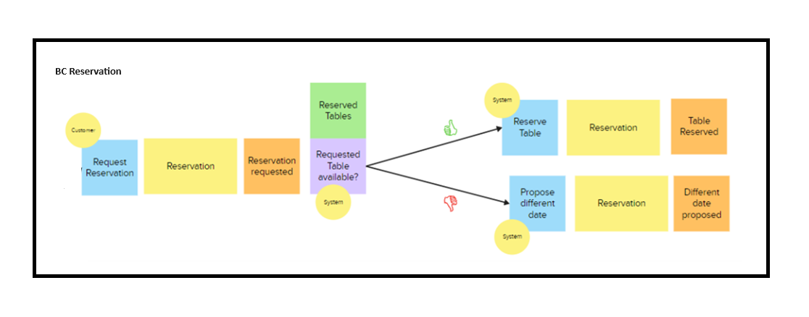

# From Event Storming to User Stories and beyond

This Blog describes how Event Storming results can be translated into user stories and how these user stories can then be used as a starting point to create your domain model.

## Event Storming

Event Storming, developed by Alberto Brandolini, is a great methodology to translate complex business requirements into actionable tasks.

Event Storming is executed in a collaborative workshop that bring together ALL steak holders to share their business perspective to create a shared understanding of the whole business.

As a result of an event storming workshop, the business domain is captured visually in bounded contexts with process flows, containing aggregates and domain events. 
In detail:

1. *Domain Events*
Key occurrences that change the state of the system.
2. *Commands*
Actions triggered by users or systems that cause domain events.
3. *Aggregates*
Collections of related objects that ensure consistency within the domain.
4. *Read Models*
Views that represent the data to be read by users.
5. *Bounded Contexts*
Distinct areas within a domain where particular models are valid.

An example Bounded Context **Reservation** as part of a larger Event Storming Event is shown below.


## Transition Event Storming results into user stories

Once the Event Storming session has provided a clear understanding of the domain, the next step is to translate this knowledge into user stories. User stories are concise, simple descriptions of a feature or function.

In the first step **identify Key Events and Actor**
   - Review the domain events and actors identified during the Event Storming session.
   - Determine which events are crucial from a user’s perspective.

The second step is to **Define User Goals**
   - For each key event, ask what goal the user is trying to achieve.
   - Use the format: “As a [type of user], I want [an action] so that [a benefit].”

Next: **Detail out Acceptance Criteria**
   - Define clear, testable conditions that must be met for the user story to be considered complete.
   - This ensures the development team knows exactly what is expected.

Finally **prioritize User Stories**
   - Work with stakeholders to prioritize user stories based on business value and complexity.
   - Use techniques such as MoSCoW (Must have, Should have, Could have, and Won't have) to classify stories.

## Let’s take an example:

Consider a café that offers a reservation service on their web site:


 
1. Identify Key Events and Actor

    Image, you as the potential customer want to reserve a table in the café. Your requirements are:
    - Table for three persons
    - Next Monday afternoon at 2 p.m.

    You go to the website of the café and navigate to the reservation page. 
    > [command] “Request Reservation”

    A form is offered where you can put the necessary data, like your name, your email address and the reservation date/time and the number of persons. When you press the submit/send button you trigger
    > [event] “Reservation requested”

    The system is now working on this request by querying a view or read model
    > [read model]“reserved tables”.

    If [policy/decision]requested-table is available, the system will reserve the table
    If [policy/decision]requested-table is not available, the system will propose available tables for a “different” date.

2. Define User Goals

    The command is now translated into a user story with the following pattern:
    > As a [type of user], I want [an action] so that [a benefit].
    > As a [customer], I want [to enter my data] so that [the system can reserve a table for me and my family]

3. Detail out Acceptance Criteria

    Acceptance Criteria are the rules that keep your aggregate (Reservation) consistent. Write a test case for every rule by detailing the rule (finding the invariant) to ensure consistency:
    - The system offers fields for necessary data.
        -   Name and Email address are mandatory
        -   Date and time are mandatory too
    - The system validates input data
        -	Email address needs ‘.’ before and after ‘@’
        -	Reservation date and time when the café is open
        -	Latest reservation time one hour before closing


*helper.py*
```
import datetime

weekDays = {
    'Monday' : 1,
    'Tuesday' : 2,
    'Wednesday' : 3,
    'Thursday' : 4,
    'Friday' : 5,
    'Saturday' : 6,
    'Sunday' : 7
}

def get_weekday_as_number(timeStr):
    return weekDays[get_weekday(timeStr)]

def get_weekday(timeStr):
    d = datetime.datetime.strptime(timeStr, '%Y-%m-%d')
    return d.strftime('%A')

def decrease_by_one_hour(timeString):
    # assumed input format 'hh:mm'
    minutes = int(timeString.split(':')[0])*60+int(timeString.split(':')[1]) - 60
    return '%02d:%02d' % (minutes//60, minutes%60)
```

*model.py*
```
openingTimes = {
    'Tuesday':  ('09:00', '19:00'),
    'Wednesday':('09:00', '13:00'),
    'Thursday': ('09:00', '19:00'),
    'Friday':   ('09:00', '19:00'),
    'Saturday': ('09:00', '19:00'),
    'Sunday':   ('13:00', '19:00')
}

class Reservation():
    pass
```


*test_reservation.py*
```
import unittest
import helper
import model

class TestReservation(unittest.TestCase):

    def setUp(self):
        self.reservation = model.Reservation()
        self.reservation.name = 'Thomas Muster'
        self.reservation.email = 'thomas.muster@sap.com'
        self.reservation.date = '2024-07-12'
        self.reservation.time = '15:00'
        self.reservation.number_of_persons = 3

    def test_date_during_open_days(self):
        openingDays = [1,2,3,4,5,7]
        self.assertTrue(helper.get_weekday_as_number(self.reservation.date) in openingDays)

    def test_date_not_during_open_days(self):
        openingDays = [1,2,3,4,6,7]
        self.assertFalse(helper.get_weekday_as_number(self.reservation.date) in openingDays)

    def test_time_during_open_hours(self):
        openingHours = ('09:00', '18:00')
        self.assertTrue(openingHours[0] <= self.reservation.time <= openingHours[1])

    def test_time_not_during_open_hours(self):
        openingHours = ('09:00', '14:00')
        self.assertFalse(openingHours[0] <= self.reservation.time <= openingHours[1])

    def test_time_date_during_opening(self):
        weekday = helper.get_weekday(self.reservation.date)
        openThatDay = model.openingTimes[weekday]
        self.assertTrue(weekday in model.openingTimes.keys() and 
            openThatDay[0] <= self.reservation.time <= openThatDay[1])

    def test_time_date_not_during_opening_1(self):
        self.reservation.time = '08:00'
        weekday = helper.get_weekday(self.reservation.date)
        openThatDay = model.openingTimes[weekday]
        self.assertFalse(weekday in model.openingTimes.keys() and 
            openThatDay[0] <= self.reservation.time <= openThatDay[1])

    def test_time_date_not_during_opening_2(self):
        self.reservation.date = '2024-07-08'
        weekday = helper.get_weekday(self.reservation.date)
        with self.assertRaises(KeyError):
            model.openingTimes[weekday]

    def test_60_minutes_before_closing_works(self):
        self.reservation.time = '18:00'
        weekday = helper.get_weekday(self.reservation.date)
        openToday = model.openingTimes[weekday]
        latest_reservation = helper.decrease_by_one_hour(openToday[1]) 
        self.assertTrue(weekday in model.openingTimes.keys() and 
            openToday[0] <= self.reservation.time <= latest_reservation)    

    def test_30_minutes_before_closing_fails(self):
        self.reservation.time = '18:31'
        weekday = helper.get_weekday(self.reservation.date)
        openToday = model.openingTimes[weekday]
        latest_reservation = helper.decrease_by_one_hour(openToday[1]) 
        self.assertFalse(weekday in model.openingTimes.keys() and 
            openToday[0] <= self.reservation.time <= latest_reservation)
```


4. Prioritize User Stories

    Prioritization is important to work on those stories first that bring the highest value to the customer and/or are a dependencies for other stories.

## SUMMARY

    Transitioning from Event Storming to user stories bridges the gap between high-level domain understanding and actionable development tasks. By following a structured approach, teams can ensure that they capture the essence of business requirements and translate them into features that deliver real value to users.

