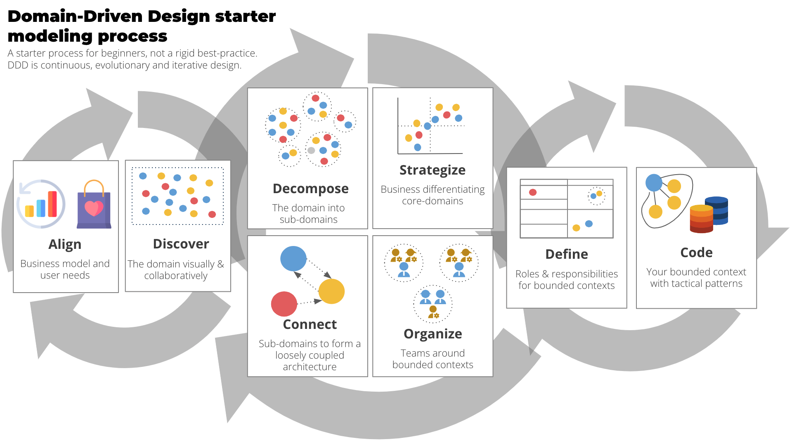
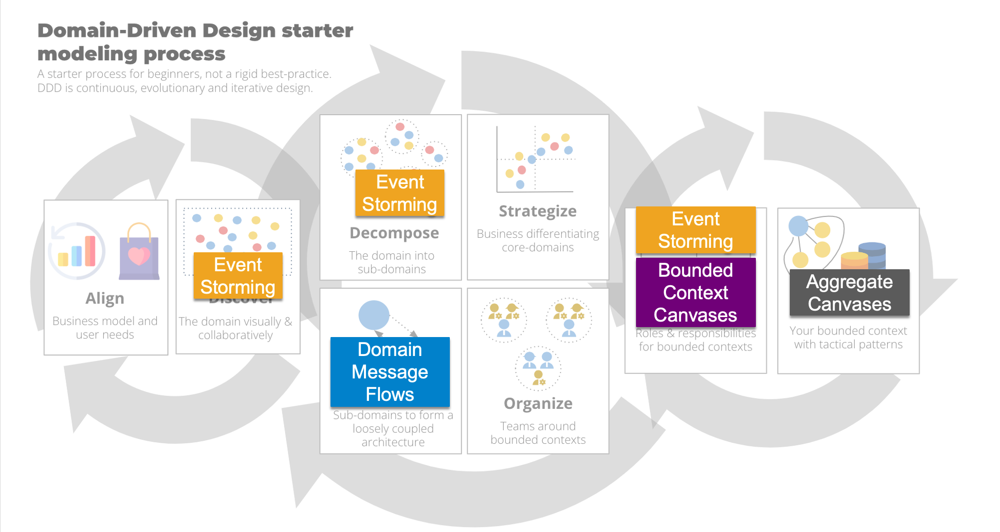
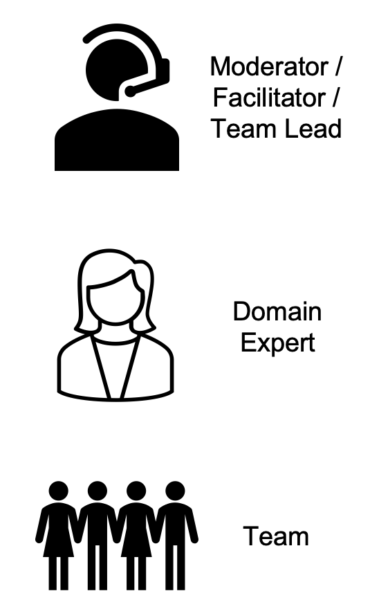
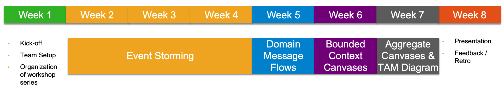

# Domain-Driven Design Kata

## What is a Kata?

A kata is a specific sequence of movements and techniques practiced in the martial arts. The word "kata" is Japanese and is used in many martial arts originating from Japan, such as karate, judo, and aikido. Kata is usually taught by a sensei, who will demonstrate the movements and then guide the students as they practice the kata. The practice of kata can help martial artists to develop proper technique, balance, and control, and to learn the application of various techniques in a practical context. Some martial arts styles have kata that are performed solo, while others require a partner.
Additionally, kata is also commonly used in software development to practice writing software that accomplishes specific tasks, by following a predetermined set of steps. The goal of the practice is to create software that is reliable, easy to maintain and flexible. These principles are now applied in practicing Domain-Driven Design.

## Follow the DDD starter modelling process

This [process](https://github.com/ddd-crew/ddd-starter-modelling-process) walks you through each stage of understanding and executing Domain-Driven Design (DDD), from understanding an organization's business model to coding a domain model.

After a few cycles of the process, you understand the core DDD theory as well as practical experience to go deeper into DDD. You will then be able to alter and develop the procedure to meet your demands in every situation. In a real project, you'll frequently switch back and forth between these processes.

Please note, that the DDD Kata will not touch all aspects of the DDD Starter Modelling Process. We have selected only a subset of tools.

## Selected Tooling for the DDD Kata

In the DDD Kata you can experience a selected subset of tools proposed by the DDD Starter Modelling Process.

| Tool                                                                             | Description                                                                                                                                                                                                                                                                                                                                                                                                                                                                                                                                                                                                                                                                                                                                                                                                                                                                                                                                                |
| -------------------------------------------------------------------------------- | ---------------------------------------------------------------------------------------------------------------------------------------------------------------------------------------------------------------------------------------------------------------------------------------------------------------------------------------------------------------------------------------------------------------------------------------------------------------------------------------------------------------------------------------------------------------------------------------------------------------------------------------------------------------------------------------------------------------------------------------------------------------------------------------------------------------------------------------------------------------------------------------------------------------------------------------------------------- |
| [EventStorming](https://www.eventstorming.com/)                                  | EventStorming is a versatile workshop model for exploring complicated business subjects together. It comes in a variety of flavors that may be utilized in a variety of situations: to evaluate the health of an existing line of business and identify the most effective areas for improvement; to investigate the viability of a new startup business model; to imagine new services that maximize positive outcomes for all parties involved; and to design clean and maintainable Event-Driven software to support rapidly evolving businesses. EventStorming's adaptable nature enables sophisticated cross-discipline interaction amongst stakeholders from various backgrounds, offering a new sort of cooperation that transcends silos and specialism barriers. Use this tool to model the the end-to-end process and identify the bounded contexts.                                                                                             |
| [Domain Message Flow](https://github.com/ddd-crew/domain-message-flow-modelling) | Developing loosely linked systems involves more than just neatly drawn boundaries. Interactions between bounded contexts must also be carefully described. A bounded context is a subsystem in a software architecture that is aligned with a certain domain. It may be built as a microservice or as a monolithic module. A Domain Message Flow Diagram (DMFD) is a basic visual representation of the flow of messages (commands, events, and inquiries) between actors, bounded contexts, and systems in a single scenario. Use Domain Message Flow to evaluated how the Bounded Contexts, System (e.g. UI, Terminals, ...) and Actors / User are interacting with each other.                                                                                                                                                                                                                                                                          |
| [Bounded Context Canvas](https://github.com/ddd-crew/bounded-context-canvas)     | The Bounded Context Canvas is a collaborative design tool for creating and documenting a single bounded context. The canvas walks you through the process of developing a bounded context by pushing you to examine and make decisions about essential design components such as nomenclature, responsibilities, public interface, and dependencies. Use the Bounded Context Canvas to model and understand the scope of the Bounded Context itself.                                                                                                                                                                                                                                                                                                                                                                                                                                                                                                       |
| [Aggregate Canvas](https://github.com/ddd-crew/aggregate-design-canvas)          | The Aggregate Design Canvas is a modeling tool that should be used in conjunction with design-level domain modeling efforts. Eric Evans first described aggregates as a lifecycle pattern. We define aggregate as a network of objects that serves as a consistency boundary for our domain regulations. Depending on how the aggregate is designed, we can either enforce them (making them invariant) or be compelled to implement corrective measures. As a result, it is critical to carefully establish aggregate borders, as they influence the behaviors modeled inside our domain. The canvas features a suggested working order that aids in iteratively discussing various components of the overall design. Here you go back to the Event Storming and find the aggregates defined in the process. Aggregates with the same name can appear in several bounded contexts. They are different and might reflect different aspects of the process. |

## The DDD Kata

### Task

* Select a collaboration tool for your choice. In SAP we are using Mural. In the DDD Community Miro is used a lot.
* **Form a working group** (up to 8 people). Declare one member a domain expert (maybe a substitute) and one member as facilitator / moderator
* Perform a **Big Picture Event Storming** with your group in collaboration tool of choice
* **Identify the bounded context and aggregates** within evaluated process in collaboration tool of choice
* Establish the message flow from Bounded Context to Bounded Context using the **Domain Message Flow** Diagrams in collaboration tool of choice.
* For each identified Bounded Context, specify using the **Bounded Context Canvas** in collaboration tool of choice.
* Within the defined Bounded Contexts, defined the aggregates using the **Aggregate canvases** in collaboration tool of choice.

### The Requirements

Let’s assume you are a start-up, and you want to provide software for parking lots & garages for all major cities in Europe and for various park area providers.

1. You can enter and leave the parking lot or the parking garage through several entrances and exits.
2. There are specific parking spots for different types of vehicles (motorcycles, car, electric car, truck/bus, handicapped persons, family-friendly parking spots)
3. Each parking spot has a unique identifier (for parking garage – number & floor or for parking lot – number &  area)
4. The customer may collect a ticket at each entrance and leave via any exit.
5. The ticket given to customer contains a parking spot ID where to park
6. The ticketing information must be stored for 10 years due to tax reasons.
7. There are three types of terminals:
   1. The terminals at the entrances have a way for the customer to communicate the vehicle details to the system.
   2. Customer drive into the parking garage / lot via entrance terminals where the collect the tickets
   3. The terminals near the exits have a way to pay the ticket.
   4. Detail out the actual payment process like select payment method, put in credit card, enter PIN are not relevant here.
8. The terminals at the exit gates collect the paid ticket.
9. The ticket has a read/write magnetic stripe containing information including a position to park.
10. The magnetic stripe can be changed by the terminals.
11. Parking garages have a parking guiding system, that guides customers to the correct parking spot. The guiding system recognizes the vehicle and guides it to the right parking spot.
12. Parking lots do not have such a system.

As domain expert, please stay from requirements perspective within these guardrails. You can detail them out as much as you want.

### The Process

#### Define the Team

As a **Moderator / Facilitator**, your task is to organize the workshops and conduct the workshops.

As a **Domain Expert**, your tasks are:

* Mimics the expert for parking lot software & management
* Takes business decisions, has the last say on requirements
* Researches and creates requirements

As a **Team Member** your tasks are:

* Interview the Domain Expert
* Create the deliverables
* Participate actively in all workshops

#### Plan your timeline

* Plan to have ~4h a week of modelling sessions
* Work iteratively (e.g. while working on Aggregate Canvas you might want to adjust your Event Storming)
* As a moderator, strife for consensus and alignment in the team
* Plan your time carefully. Timebox your efforts.
* Most importantly, have fun modelling.

#### How to run an Event Storming Workshop

Event storming is a collaborative workshop method that helps to explore complex business domains and model them using events. An event is an action that occurred in the system at a specific time. Event storming can be conducted in two phases: a high-level event storm to identify the domains and then a detailed event storm to focus on a core domain.

The high-level event storm consists of these steps:

1. **Chaotic Exploration**: Invite the right people from different perspectives and roles, such as domain experts, developers, testers, etc. Provide unlimited modeling space, such as a wall or a whiteboard. Ask everyone to write down relevant events in the domain and the process that they are analyzing on sticky notes. Use different colors for different types of events, such as past, present, future, etc. Encourage everyone to participate and share their ideas without filtering or criticizing.
2. **Enforce the Timeline**: Arrange the sticky notes on the modeling space in a chronological order, from left to right. Use a horizontal line to separate different processes or subdomains. Identify any gaps, duplicates, inconsistencies or ambiguities in the events and resolve them with the help of the participants. Use arrows or lines to show the causal relationships between events.
3. **Enforce Consistency**: Review the timeline and check if it makes sense and reflects the reality of the domain. Ask questions such as "What happens next?", "What triggers this event?", "Who is involved in this event?", etc. Use different symbols or colors to mark different aspects of the events, such as commands, aggregates, policies, external systems, users, etc. Add any missing or new events that emerge from the discussion.
4. **Identify the Bounded Contexts**: Group the events into logical clusters that represent different subdomains or areas of responsibility in the domain. These are called bounded contexts. A bounded context is a coherent and consistent set of events that share a common language and meaning. Use different shapes or colors to highlight the boundaries of each bounded context. Name each bounded context and label its main purpose or goal.
5. **Detailed Design**: Zoom in on the core domain and refine its events and relationships. Use different symbols or colors to mark different elements of the domain model, such as entities, value objects, aggregates, services, repositories, factories, etc. Define the properties and behaviors of each element and how they interact with each other. Use scenarios or examples to validate and test the model. Identify any constraints, rules, policies or assumptions that affect the model and document them. Use the detailed design also to validate your bounded contexts.

#### How to model Domain Message Flow

A Domain-Message Flow Diagram is a simple visualization showing the flow of messages (commands, events, queries) between actors, bounded contexts, and systems, for a single scenario. It helps to understand the interactions and dependencies between different parts of the domain and to identify potential issues or opportunities for improvement.

To use the Domain-Message Flow, you need to follow these steps:

1. **Choose a scenario**: Pick a specific use case or user story that you want to model. It should be relevant and important for your domain. For example, "A customer places an order online".
2. **Identify the actors**: List all the people, roles, or external systems that are involved in the scenario. These are the sources or destinations of the messages. For example, "Customer", "Order Service", "Payment Service", "Inventory Service", etc.
3. **Identify the messages**: List all the messages that are exchanged between the actors in the scenario. These are the commands, events, or queries that trigger actions or convey information. For example, "Place Order", "Order Placed", "Pay Order", "Payment Confirmed", "Check Stock", "Stock Available", etc.
4. **Draw the diagram**: Use a tool or a whiteboard to draw the diagram. Use different shapes or colors to represent different types of actors and messages. Use arrows to show the direction and sequence of the messages. Use labels to name the actors and messages. Use swimlanes or boxes to group the actors by bounded contexts or subdomains. Use dashed lines to separate different processes or phases.

#### How to document your Bounded Contexts with Bounded Context Canvas

The Bounded Context Canvas is a collaborative tool for designing and documenting the design of a single bounded context. A bounded context is a sub-system in a software architecture aligned with a part of your domain. A bounded context can be seen as a unit of language consistency, a boundary for a model expressed in a consistent language, and a boundary for team autonomy.

**Choose a bounded context:** Pick a specific sub-system or module that you want to design or document. It should be relevant and important for your domain. For example, “Order Service”, “Payment Service”, “Inventory Service”, etc.

**Fill in the canvas:** Use a tool or a whiteboard to fill in the canvas. The canvas consists of nine sections that cover different aspects of the bounded context design. These are:

   **Purpose**: Describe the main purpose or goal of the bounded context in one sentence. Use active verbs and avoid technical terms. This helps to clarify the scope and alignment of the bounded context.

   **Strategic Classification**: Classify the bounded context according to its strategic importance and relationship with other bounded contexts. Use one of these four categories: Core Domain, Supporting Subdomain, Generic Subdomain, or External System. This helps to prioritize the investment and effort for each bounded context.

   **Domain Roles**: List the main roles or personas that interact with or benefit from the bounded context. These can be internal or external users, customers, partners, etc. This helps to understand the needs and expectations of the stakeholders.

   **Inbound Communication**: List the main types and sources of incoming messages or requests that the bounded context receives from other bounded contexts or systems. These can be commands, events, queries, etc. This helps to understand the dependencies and contracts of the bounded context.

   **Outbound Communication**: List the main types and destinations of outgoing messages or responses that the bounded context sends to other bounded contexts or systems. These can be commands, events, queries, etc. This helps to understand the impact and obligations of the bounded context.

   **Ubiquitous Language**: List the key terms and concepts that are used in the bounded context and define them using the domain language. Use nouns, verbs, adjectives, and adverbs that are meaningful and consistent within the bounded context. This helps to establish a common understanding and communication within the team and with other teams.

   **Business Decisions**: List the main business rules or policies that govern the behavior and logic of the bounded context. These can be constraints, validations, calculations, etc. This helps to capture the domain knowledge and complexity of the bounded context.

   **Assumptions**: List the main assumptions or hypotheses that underlie the design and implementation of the bounded context. These can be about the domain, the users, the technology, etc. This helps to identify and validate the risks and uncertainties of the bounded context.

   **Verification Metrics**: List the main metrics or indicators that measure the performance and value of the bounded context. These can be quantitative or qualitative data that reflect the goals and outcomes of the bounded context. This helps to evaluate and improve

#### How to document your Aggregates with Aggregate Canvas

Sure, I can try to describe how to use the Aggregate Canvas based on the resource that you provided and what I found on the web. Here is a summary:

The Aggregate Canvas is a modelling tool meant to be used as a part of design-level domain modelling activities²³. An aggregate is a lifecycle pattern originally described by Eric Evans. By aggregate, we understand a graph of objects that is a consistency boundary for our domain policies²³.

To use the Aggregate Canvas, you need to follow these steps²³:

1. **Choose an aggregate**: Pick a specific aggregate that you want to design or document. It should be relevant and important for your domain. For example, "Order", "Customer", "Product", etc.
2. **Before you fill the canvas**: You should revise your event storming results and identify the aggregates mentioned in the detailed design phase. You should have clarity on the following attributes.

* **Name**: Give a descriptive and meaningful name to the aggregate that reflects its purpose and domain language.
* **Responsibility**: Describe the main responsibility or goal of the aggregate in one sentence. Use active verbs and avoid technical terms.
* **Invariants**: List the main business rules or policies that must be enforced by the aggregate to ensure its consistency and validity. These can be constraints, validations, calculations, etc.
* **Entities**: List the main entities that are part of the aggregate and define their properties and behaviors. An entity is an object that has an identity and a lifecycle within the aggregate. Use nouns and adjectives that are meaningful and consistent within the aggregate.
* **Value Objects**: List the main value objects that are part of the aggregate and define their properties and behaviors. A value object is an object that has no identity and is immutable within the aggregate. Use nouns and adjectives that are meaningful and consistent within the aggregate.
* **Domain Events**: List the main domain events that are emitted by the aggregate when something important happens within its lifecycle. A domain event is an object that captures a fact or a change in the state of the aggregate. Use past tense verbs and nouns that are meaningful and consistent within the aggregate.
* **Commands**: List the main commands that are accepted by the aggregate to perform actions or changes on its state. A command is an object that expresses an intention or a request to do something on the aggregate. Use imperative verbs and nouns that are meaningful and consistent within the aggregate.
* **External Dependencies**: List the main external dependencies that are required by the aggregate to perform its responsibility. These can be other aggregates, services, systems, etc. Specify their roles, types, and communication modes.

After this you should be able to fill out the canvas with the following attributes:

* **Name**: The name of the aggregate that reflects its purpose and domain language. It should be a noun or a noun phrase that is meaningful and consistent within the bounded context.
* **Description**: A short description of the aggregate that summarizes its main responsibility or goal. It should be a sentence that uses active verbs and avoids technical terms.
* **State Transitions**: The possible states and transitions of the aggregate within its lifecycle. A state is a condition or situation of the aggregate at a given time. A transition is a change from one state to another triggered by an event or a command.
* **Enforced Invariants**: The business rules or policies that must be enforced by the aggregate to ensure its consistency and validity. These can be constraints, validations, calculations, etc. They should be expressed in domain language and be testable.
* **Corrective Policies**: The corrective actions or compensations that the aggregate performs when an invariant is violated or an error occurs. These can be commands, events, exceptions, etc. They should be expressed in domain language and be traceable.
* **Handled Commands**: The commands that are accepted by the aggregate to perform actions or changes on its state. A command is an object that expresses an intention or a request to do something on the aggregate. They should be expressed in imperative verbs and nouns that are meaningful and consistent within the aggregate.
* **Created Events**: The events that are emitted by the aggregate when something important happens within its lifecycle. An event is an object that captures a fact or a change in the state of the aggregate. They should be expressed in past tense verbs and nouns that are meaningful and consistent within the aggregate.
* **Throughput**: The expected or actual number of commands or events that the aggregate handles per unit of time. This can be used to measure the performance and scalability of the aggregate.

## Resources

* IBM Cloud Architecture Center: [Event Storming Methodology Architecture](https://www.ibm.com/cloud/architecture/architecture/practices/event-storming-methodology-architecture/).
* Lucidchart Blog: [What Is Event Storming?](https://www.lucidchart.com/blog/ddd-event-storming).
* Lucidspark: [8 Steps in the Event Storming Process](https://lucidspark.com/blog/8-steps-in-the-event-storming-process).
* VMware Tanzu Developer Center: [Event Storming](https://tanzu.vmware.com/developer/practices/event-storming/).
* Miroverse: [Judith Birmoser's Event Storming Template](https://miro.com/miroverse/event-storming/).
* Studiosoftware: [Event Storming Example: What the Process Looks Like Step-by-Step](https://studiosoftware.com/blog/event-storming-example-what-the-process-looks-like-step-by-step/).
* Github: [ddd-crew/domain-message-flow-modelling.](https://github.com/ddd-crew/domain-message-flow-modelling)
* Virtual Domain-Driven Design - Domain Message Flow: [A Community of Practice.](https://virtualddd.com/learning-ddd/ddd-crew-domain-message-flow-modelling/)
* Medium: [Modelling Bounded Contexts with the Bounded Context Canvas: A Workshop Recipe.](https://medium.com/nick-tune-tech-strategy-blog/modelling-bounded-contexts-with-the-bounded-context-design-canvas-a-workshop-recipe-1f123e592ab)
* Github: [ddd-crew/bounded-context-canvas.](https://github.com/ddd-crew/bounded-context-canvas)
* Virtual Domain-Driven Design - Bounded Context Canvas: [A Community of Practice](https://virtualddd.com/learning-ddd/ddd-crew-bounded-context-canvas/).
* Medium: [Bounded Context Canvas V3: Simplifications and Additions.](https://medium.com/nick-tune-tech-strategy-blog/bounded-context-canvas-v2-simplifications-and-additions-229ed35f825f)
* Miroverse: [Nick Tune's Bounded Context Canvas Template.](https://miro.com/miroverse/the-bounded-context-canvas/)
* Medium: [Bounded Context Canvas Recipe: Use Case Swimlanes.](https://medium.com/nick-tune-tech-strategy-blog/bounded-context-canvas-recipe-use-case-swimlanes-11ca647175d3.)
* [Kacper Gunia's Aggregate Design Canvas template | Miroverse](https://miro.com/miroverse/aggregate-design-canvas/)
* [The Aggregate Design Canvas - Github](https://github.com/ddd-crew/aggregate-design-canvas)
* [Virtual Domain-Driven Design - Aggregate Canvas - A community of practise](https://virtualddd.com/learning-ddd/ddd-crew-aggregate-design-canvas/)
* DDDDD-20 [Aggregate Canvas: A fluent way to walk through ... - YouTube](https://www.youtube.com/watch?v=AF880t1RUU4). .
* Modelling aggregates with ["Aggregate Design Canvas"](https://domaincentric.net/blog/modelling-aggregates-with-aggregate-design-canvas).
