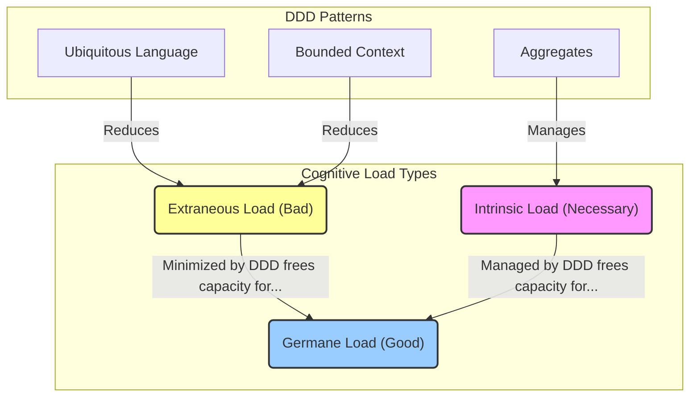

# Cognitive Load in Domain-Driven Design

## Introduction

In software engineering, **cognitive load** refers to the total mental effort required to understand, maintain, and work with a software system. High cognitive load is a primary driver of accidental complexity, leading to slower development, increased bugs, and developer burnout. Domain-Driven Design provides a powerful set of strategic and tactical patterns to explicitly manage and reduce this load.

The core idea is to align the software model with the business domain, making the system more intuitive and easier to reason about. By managing complexity, DDD frees up developers' mental capacity to focus on solving real business problems instead of wrestling with convoluted code.

## Cognitive Load Theory Fundamentals

**Cognitive Load Theory** is a framework from educational psychology that describes the limits of human working memory. Developed by John Sweller, it posits that our ability to process new information is finite, and overloading this working memory can hinder learning and problem-solving. The theory is highly relevant to software design, as developers must constantly learn, process, and manage complex information.

Cognitive Load Theory identifies three distinct types of cognitive load that sum up to the total mental effort being used:

### 1. Intrinsic Cognitive Load (The Necessary Load)

**Intrinsic cognitive load** is the inherent level of difficulty associated with a specific subject. It is the complexity that is essential to the problem domain itself and cannot be removed, only managed.

This load is determined by the number of interacting elements or concepts that must be held in working memory at one time. For example, understanding a simple CRUD operation has a low intrinsic load, while understanding a distributed transaction across multiple microservices has a very high intrinsic load.

In DDD, the intrinsic cognitive load is dictated by the complexity of the business domain. A domain like e-commerce has inherent complexities—product catalogs, pricing rules, inventory, shipping—that the software must model.

**Important Note**: You cannot eliminate intrinsic complexity. Attempting to oversimplify a naturally complex domain often leads to a model that is too weak to solve the business's problems, a phenomenon known as a "Distorted Model."

### 2. Extraneous Cognitive Load (The Bad Load)

**Extraneous cognitive load** (or extrinsic load) is the mental effort wasted on things that are not essential to the problem being solved. It is the "bad" load, imposed by poor design, inconsistent structure, or confusing presentation. This is the primary type of cognitive load that good software design aims to eliminate.

In software development, sources of extraneous load are everywhere:

- **Inconsistent Naming**: A method called `getUser` in one class and `fetchCustomer` in another.
- **Poor Architecture**: A tangled mess of dependencies that forces a developer to understand the entire system just to make a small change.
- **Technical Jargon vs. Business Language**: The mental gymnastics required to translate what a domain expert calls a "Shipment" into what the code calls a `PackageDeliveryObject`.
- **Complex Tooling**: A build process that requires ten arcane commands to run the application.

Every ounce of mental energy a developer spends deciphering *how* the code works is energy they *cannot* spend on understanding *what* the code is supposed to do for the business.

### 3. Germane Cognitive Load (The Good Load)

**Germane cognitive load** is the "good" or "productive" load. It is the mental effort directed towards processing information, constructing robust mental models (schemas), and developing a deep understanding of a topic. This is the cognitive work that leads to genuine learning and insight.

While intrinsic and extraneous cognitive load occupy working memory, germane load is the process of taking what is in working memory and connecting it to existing knowledge in long-term memory.

The goal of a well-designed system is to minimize extraneous load and manage intrinsic load, thereby maximizing the cognitive resources available for germane load. We want developers to spend their mental energy on these productive tasks:

- **Building Mental Models**: Thinking about how different parts of the business domain interact.
- **Understanding Core Logic**: Deeply processing the business rules and invariants within an aggregate.
- **Pattern Recognition**: Identifying opportunities to apply a design pattern or refactor towards a clearer model.
- **Strategic Thinking**: Considering the long-term implications of a design choice.

Germane load is the feeling of being "in the zone" or in a state of flow, where you are productively untangling a complex problem and the solution is crystallizing in your mind. This can only happen when you are not being constantly distracted by unnecessary (extraneous) complexity.

## How DDD Manages Cognitive Load

Domain-Driven Design is not just one technique, but a holistic approach that reduces all three types of cognitive load:

### Reducing Extraneous Cognitive Load

DDD fundamentally aims to reduce extraneous cognitive load for developers through several patterns:

#### Ubiquitous Language

By creating a shared, precise language for both developers and domain experts, DDD eliminates the mental tax of translation. The language of the business *is* the language of the code.

**Example**:

```java
// Without Ubiquitous Language (extraneous load)
public class PackageDeliveryObject {
    private String pdoId;
    private int statusCode; // What does status code 3 mean?
}

// With Ubiquitous Language (reduced extraneous load)
public class Shipment {
    private ShipmentId id;
    private ShipmentStatus status; // PENDING, IN_TRANSIT, DELIVERED
}
```

The second example uses the same terms the business uses, eliminating the need for mental translation.

#### Bounded Context

This pattern explicitly separates different parts of a large system. A developer working in the "Billing Context" does not need to hold the complexities of the "Shipping Context" in their head, drastically reducing the mental space required to be effective.

**Example**:

In a billing context, a "Customer" might be:
```java
public class Customer {
    private CustomerId id;
    private PaymentMethod paymentMethod;
    private BillingAddress billingAddress;
}
```

In a shipping context, the same "Customer" might be:
```java
public class Customer {
    private CustomerId id;
    private ShippingAddress shippingAddress;
    private List<DeliveryPreference> preferences;
}
```

[Bounded Context](../strategic-concepts/boundedcontext.md) prevents "model pollution" by ensuring that a term like `Customer` has one, and only one, meaning within a specific part of the system, removing ambiguity and the mental effort required to resolve it.

#### Clean Architecture

Architectural patterns often used with DDD, such as Hexagonal Architecture, separate the core domain logic from technical concerns (like databases or APIs), reducing the cognitive load of having to think about infrastructure and business rules at the same time.

### Managing Intrinsic Cognitive Load

DDD patterns help manage the inherent complexity of the business domain:

#### Aggregates

[Aggregates](../tactical-concepts/aggregate.md) act as consistency boundaries that cluster related entities and value objects into a single, understandable unit. This allows developers to reason about a small, cohesive model (the `Order` aggregate) instead of a tangled web of individual objects, simplifying the inherent complexity.

**Example**:

```java
// Instead of managing 5+ separate entities
OrderHeader header = ...;
OrderLine line1 = ...;
OrderLine line2 = ...;
ShippingAddress address = ...;
OrderTotal total = ...;

// Manage a single aggregate
Order order = Order.create(customerId);
order.addProduct(productId, quantity, unitPrice);
order.setShippingAddress(address);
order.submit();
```

By grouping related objects into a single unit, aggregates reduce the number of interacting elements a developer has to think about at once. It encapsulates complexity.

#### Collaborative Modeling

Techniques like [EventStorming](../../tools/eventstorming.md) and Domain Storytelling help teams break down complex domains into understandable pieces, managing the intrinsic load by tackling it systematically.

These workshop-based approaches allow domain experts and developers to collaboratively explore the domain, breaking it into digestible chunks and identifying the most complex areas that need attention.

### Maximizing Germane Cognitive Load

By minimizing extraneous load and managing intrinsic load, DDD frees up mental resources. This allows developers to invest their cognitive capacity in what truly matters: building a deep understanding of the domain and creating a robust, expressive model that solves business problems effectively.

DDD fosters germane load by making the domain model the central focus. When a developer works with code that is a clean reflection of the business domain (thanks to [Ubiquitous Language](../strategic-concepts/ubiquitouslanguage.md)), their mental effort is spent understanding the *business problem*, which is exactly where it should be.

**Goal**: The goal of applying DDD is to shift the developer's effort away from extraneous load and toward germane load. We want developers thinking about the *business problem* (germane), not fighting the *code* (extraneous).

## Visualization: DDD's Impact on Cognitive Load



This diagram illustrates how DDD patterns directly target different types of cognitive load:

- **Ubiquitous Language** and **Bounded Context** reduce extraneous (bad) load
- **Aggregates** manage intrinsic (necessary) load
- By reducing extraneous and managing intrinsic load, DDD frees capacity for germane (good) load

## Practical Applications

### How Bounded Context Reduces Extraneous Load

Without Bounded Context, developers must maintain mental translations between different meanings of the same term:

- "Is this the `Product` from Catalog or Inventory?"
- "Does `price` include tax here, or is that only in Billing?"
- "Wait, which version of the `Customer` model am I looking at?"

With Bounded Context, these questions disappear. Each context has its own model with clear, unambiguous meanings.

### How Aggregates Manage Intrinsic Load

Consider an order processing system. Without aggregates, a developer must simultaneously think about:

- Order headers, line items, pricing rules
- Inventory checks, shipping calculations
- Payment processing, tax calculations
- Customer data, product data

With aggregates, the developer thinks about:

- The `Order` aggregate (order header, lines, totals)
- The `Inventory` aggregate (stock levels, reservations)
- The `Payment` aggregate (payment method, transaction)

Each aggregate is a self-contained consistency boundary, dramatically reducing the number of moving parts to think about at once.

### How Ubiquitous Language Maximizes Germane Load

When code uses business terminology:

```java
public class Order {
    public void submit() {
        if (!canBeSubmitted()) {
            throw new OrderCannotBeSubmittedException();
        }
        this.status = OrderStatus.SUBMITTED;
        notifyCustomer();
    }
}
```

Developers spend their mental energy understanding the *business rule* ("What does it mean for an order to be submitted?") rather than decoding technical abstractions. This is germane load at work—productive thinking about the domain.

## Conclusion

Cognitive Load Theory provides a valuable lens for understanding why Domain-Driven Design is so effective. DDD is not just about creating better software architectures—it is about creating systems that respect the cognitive limits of the humans who build and maintain them.

By explicitly targeting extraneous, intrinsic, and germane cognitive load through patterns like Ubiquitous Language, Bounded Context, and Aggregates, DDD enables developers to work more effectively, make fewer mistakes, and maintain systems with less mental strain.

The ultimate goal is to free developers to focus their mental energy where it matters most: deeply understanding the business domain and creating software that serves it well.

## Further References and Resources

### Articles

- [Cognitive Load Theory - Wikipedia](https://en.wikipedia.org/wiki/Cognitive_load)
- [Cognitive Load Theory in Software Development](https://www.simplethread.com/cognitive-load-theory-in-software-development/)
- [Managing Cognitive Load for Team Learning](https://github.blog/developer-skills/github/managing-cognitive-load-for-team-learning/)

### Books

- _Cognitive Load Theory_ by John Sweller
- _Domain-Driven Design: Tackling Complexity in the Heart of Software_ by Eric Evans
- _A Philosophy of Software Design_ by John Ousterhout

### Related Concepts

- [Bounded Context](../strategic-concepts/boundedcontext.md)
- [Ubiquitous Language](../strategic-concepts/ubiquitouslanguage.md)
- [Aggregates](../tactical-concepts/aggregate.md)
- [EventStorming](../../tools/eventstorming.md)
- [Collaborative Modeling](./collaborativemodelling.md)
