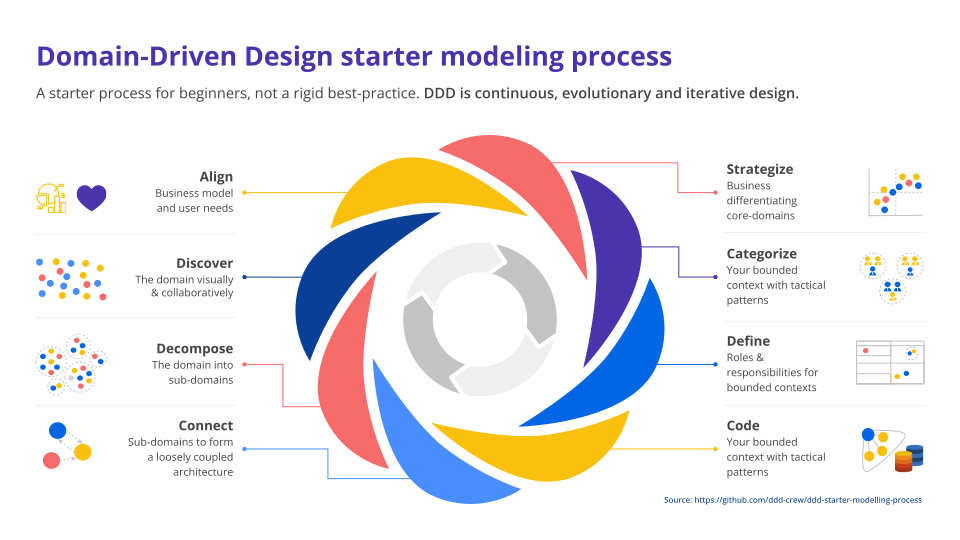

# Domain-Driven Design Modelling Process

## **Table of Contents**

- [Domain-Driven Design Modelling Process](#domain-driven-design-modelling-process)
  - [**Table of Contents**](#table-of-contents)
  - [**Introduction**](#introduction)
  - [**When to Use the DDD Modelling Process**](#when-to-use-the-ddd-modelling-process)
    - [**Kicking Off a Greenfield Project**](#kicking-off-a-greenfield-project)
    - [**Beginning a Brownfield Migration**](#beginning-a-brownfield-migration)
    - [**Starting a Major Program of Work**](#starting-a-major-program-of-work)
    - [**Exploring the Domain for New Insights**](#exploring-the-domain-for-new-insights)
    - [**Assessing the Current State of a Project**](#assessing-the-current-state-of-a-project)
    - [**Reorganizing Teams**](#reorganizing-teams)
    - [**Practicing or Learning DDD**](#practicing-or-learning-ddd)
  - [**Adapting the Process**](#adapting-the-process)
    - [**Starting with Collaborative Modeling**](#starting-with-collaborative-modeling)
    - [**Assessing the IT Landscape First**](#assessing-the-it-landscape-first)
    - [**Coding Before Confirming Architecture**](#coding-before-confirming-architecture)
    - [**Iterating Between Discovery and Organization**](#iterating-between-discovery-and-organization)
    - [**Organizing Teams Before Designing Contexts**](#organizing-teams-before-designing-contexts)
    - [**Blending Definition and Coding**](#blending-definition-and-coding)
  - [**The DDD Modelling Process Steps**](#the-ddd-modelling-process-steps)
    - [**1. Understand**](#1-understand)
    - [**2. Discover**](#2-discover)
    - [**3. Decompose**](#3-decompose)
    - [**4. Strategize**](#4-strategize)
    - [**5. Connect**](#5-connect)
    - [**6. Organize**](#6-organize)
    - [**7. Define**](#7-define)
    - [**8. Code**](#8-code)
  - [**Relation to the Whirlpool Process**](#relation-to-the-whirlpool-process)
  - [**Conclusion**](#conclusion)
  - [**Resource**](#resource)

## **Introduction**

The **Domain-Driven Design (DDD) Modelling Process** is a step-by-step guide for applying DDD principles to software development. It assists teams in aligning software systems closely with an organization's business model, ensuring that technical decisions support business goals effectively.

This process is especially beneficial for beginners who are new to DDD, providing a structured approach to navigate through the complexities of both learning and implementing DDD concepts. It emphasizes continuous iteration and evolution, recognizing that understanding and design deepen over time.

## **When to Use the DDD Modelling Process**

The DDD Modelling Process is versatile and can be applied in various scenarios to enhance the alignment between business needs and software solutions.

### **Kicking Off a Greenfield Project**

When starting a new project from scratch, the number of unknowns can be overwhelming. Applying the DDD Modelling Process helps in laying a solid foundation by:

- Clarifying business goals and user needs.
- Establishing a shared understanding among team members.
- Guiding initial architectural and design decisions.

**Example:** A startup developing an innovative e-commerce platform can use this process to ensure the platform's features align with market needs and business objectives.

### **Beginning a Brownfield Migration**

For projects involving modernization or migration of legacy systems, the process aids in:

- Understanding existing domain complexities.
- Identifying opportunities for improvement.
- Planning a phased migration strategy.

**Example:** A financial institution updating its legacy transaction system can apply the process to incrementally replace old components with new, domain-aligned services.

### **Starting a Major Program of Work**

Large initiatives involving multiple teams and significant investments benefit from:

- Coordinated planning across teams.
- Clear definition of responsibilities and boundaries.
- Alignment of technical efforts with strategic goals.

**Example:** An organization implementing an enterprise-wide customer relationship management (CRM) system can use the process to synchronize efforts across departments.

### **Exploring the Domain for New Insights**

Continuous exploration uncovers:

- Hidden complexities or constraints.
- New opportunities for innovation.
- Areas for optimization or cost reduction.

**Example:** A company may discover through domain exploration that automating a manual reporting process could save significant resources.

### **Assessing the Current State of a Project**

Regular assessments help in:

- Identifying misalignments between the domain and the software.
- Detecting technical debt or bottlenecks.
- Planning corrective actions.

**Example:** A software team reviews their project and finds that certain modules are not reflecting the current business rules, prompting a redesign.

### **Reorganizing Teams**

Aligning team structures with domain boundaries promotes:

- Autonomy and ownership.
- Improved communication within teams.
- Reduced dependencies between teams.

**Example:** A tech company restructures its teams around bounded contexts such as "User Management" and "Billing" to enhance focus and efficiency.

### **Practicing or Learning DDD**

For learning purposes, the process:

- Provides hands-on experience with DDD concepts.
- Encourages collaborative learning.
- Reduces cognitive load by offering a structured approach.

**Example:** A development team new to DDD conducts workshops using the process to build confidence in applying DDD principles.

## **Adapting the Process**

While the DDD Modelling Process provides a structured approach, it is flexible and can be adapted to suit different project needs and contexts.

### **Starting with Collaborative Modeling**

**Scenario:** The team prefers to engage immediately in modeling activities to build a shared understanding.

**Approach:**

- Begin with collaborative modeling techniques like EventStorming.
- Focus on areas of the domain familiar to the team to build confidence.
- Use modeling sessions to uncover domain knowledge and drive further steps.

**Example:** A team starts with an EventStorming session to map out the order processing flow in their system.

### **Assessing the IT Landscape First**

**Scenario:** Understanding existing technical constraints is critical before delving into domain modeling.

**Approach:**

- Map out the current architecture and systems.
- Identify technical limitations, integration points, and legacy components.
- Use this assessment to inform domain decomposition and design decisions.

**Example:** Before redesigning a supply chain system, the team evaluates existing databases and services to understand integration challenges.

### **Coding Before Confirming Architecture**

**Scenario:** Rapid prototyping is necessary to validate ideas or the domain is highly complex.

**Approach:**

- Begin with coding to create a minimal viable product (MVP).
- Use insights from coding to inform architectural decisions.
- Iterate between coding and higher-level design.

**Example:** Developing a new feature where user feedback is essential may require building a prototype first.

### **Iterating Between Discovery and Organization**

**Scenario:** The domain is complex, requiring multiple iterations to understand fully.

**Approach:**

- Repeat steps like "Discover," "Decompose," and "Organize" multiple times.
- Refine domain understanding with each iteration.
- Delay final architectural decisions until sufficient insight is gained.

**Example:** In a healthcare system, the team might iterate on patient data management to capture all regulatory requirements.

### **Organizing Teams Before Designing Contexts**

**Scenario:** Organizational constraints dictate team structures that must be considered upfront.

**Approach:**

- Identify team boundaries and capacities first.
- Design bounded contexts that align with team structures.
- Ensure that architecture supports the organizational model.

**Example:** A company with specialized teams for front-end and back-end development might define contexts accordingly.

### **Blending Definition and Coding**

**Scenario:** Immediate feedback from coding is needed to validate design choices.

**Approach:**

- Conduct "Define" and "Code" steps concurrently.
- Use coding sessions to test and refine models.
- Allow practical coding experience to influence design decisions.

**Example:** While defining the "Payment Processing" context, developers write code to validate transaction handling logic.

## **The DDD Modelling Process Steps**

The process consists of eight iterative steps, each building upon the previous to deepen domain understanding and align technical solutions with business needs.

### **1. Understand**

**Objective:** Align the team's focus with the organization's business model, user needs, and strategic goals.

**Activities:**

- Engage with stakeholders to grasp the business model.
- Use tools like the **Business Model Canvas** to visualize how the organization creates, delivers, and captures value.
- Conduct **User Story Mapping** to understand user interactions and needs.

**Who to Involve:**

- Product owners and business strategists.
- Domain experts with deep business knowledge.
- End-users or their representatives.
- Development team members.

**Example:** For a new product launch, the team maps out key value propositions and customer segments using the Business Model Canvas.

### **2. Discover**

**Objective:** Visually and collaboratively explore the domain to build a shared understanding.

**Activities:**

- Conduct workshops using techniques like **EventStorming** to map out domain events and workflows.
- Encourage open discussion to surface implicit knowledge.
- Identify key domain concepts and relationships.

**Who to Involve:**

- Domain experts and stakeholders.
- Developers, testers, and designers.
- Product managers.

**Example:** During an EventStorming session, the team uncovers that inventory updates are critical events affecting multiple processes.

### **3. Decompose**

**Objective:** Break down the domain into smaller, manageable subdomains.

**Activities:**

- Identify **core**, **supporting**, and **generic** subdomains.
- Use insights from discovery to define boundaries based on business capabilities.
- Ensure high cohesion within subdomains and loose coupling between them.

**Who to Involve:**

- Development team.
- Domain experts.

**Example:** In an online marketplace, the team defines "User Management," "Product Catalog," and "Order Processing" as separate subdomains.

### **4. Strategize**

**Objective:** Determine which subdomains are strategically important.

**Activities:**

- Evaluate subdomains to identify **core domains** that provide competitive advantage.
- Prioritize investment and resources towards core domains.
- Decide on build vs. buy vs. outsource for each subdomain.

**Who to Involve:**

- Business strategists.
- Product owners.
- Technical leads.

**Example:** Recognizing that "Recommendation Engine" is a core domain, the company invests in developing it in-house.

### **5. Connect**

**Objective:** Design interactions between subdomains to fulfill end-to-end business processes.

**Activities:**

- Map out how subdomains communicate using tools like **Domain Message Flow Modeling**.
- Identify integration patterns and potential bottlenecks.
- Ensure that interactions do not introduce unwanted coupling.

**Who to Involve:**

- Developers and architects.
- Domain experts.
- Integration specialists.

**Example:** Defining asynchronous messaging between "Order Processing" and "Inventory Management" to decouple services.

### **6. Organize**

**Objective:** Align team structures with the designed architecture for optimal flow.

**Activities:**

- Form teams around bounded contexts or subdomains.
- Consider team size, skills, and cognitive load.
- Use concepts like **Team Topologies** to define team interactions.

**Who to Involve:**

- Team leads and managers.
- HR representatives.
- Development team members.

**Example:** Establishing a dedicated team for the "Customer Support" context to improve focus and ownership.

### **7. Define**

**Objective:** Specify the roles, responsibilities, and boundaries of each bounded context.

**Activities:**

- Create detailed descriptions using tools like the **Bounded Context Canvas**.
- Define interfaces, data ownership, and dependencies.
- Address non-functional requirements such as performance and scalability.

**Who to Involve:**

- Developers and architects.
- Product owners.
- Domain experts.

**Example:** Documenting that the "Billing" context is responsible for invoicing and must comply with financial regulations.

### **8. Code**

**Objective:** Implement the domain model in code, reflecting the understanding gained.

**Activities:**

- Develop the software components within each bounded context.
- Use techniques like **Test-Driven Development (TDD)** and **Pair Programming**.
- Continuously integrate and test components.

**Who to Involve:**

- Developers.
- QA testers.
- DevOps engineers.

**Example:** Coding the "Shipping" context with entities like "Shipment" and "DeliveryRoute," ensuring they align with domain concepts.

## **Relation to the Whirlpool Process**

The DDD Modelling Process relates to Eric Evans' **Whirlpool Process**, which emphasizes continuous learning and refinement in domain modeling. Both processes share the iterative nature of exploring, experimenting, and evolving the domain model.

**Similarities:**

- **Iterative Approach:** Both processes encourage revisiting steps as new insights are gained.
- **Focus on Collaboration:** Emphasize the importance of involving domain experts and stakeholders.
- **Evolutionary Design:** Recognize that understanding deepens over time, requiring adjustments.

**Differences:**

- **Broader Scope:** The DDD Modelling Process extends beyond modeling to include organizational alignment and team structuring.
- **Structured Steps:** Provides a more detailed step-by-step guide, which is beneficial for beginners.

**Example:** While the Whirlpool Process might focus on refining domain models through cycles of discovery and experimentation, the DDD Modelling Process guides teams from initial understanding to coding, including strategic and organizational considerations.

## **Conclusion**

The Domain-Driven Design Modelling Process offers a comprehensive approach to aligning software development with business domains. By following its iterative steps, teams can ensure that they are building software that not only meets technical requirements but also delivers meaningful business value.

Adapting the process to fit specific project needs allows for flexibility, ensuring that teams can focus on areas most critical to their success. Whether starting a new project, modernizing an existing system, or exploring new business opportunities, this process serves as a valuable guide in navigating the complexities of domain-driven software design.

## **Resource**

- [DDD Starter Modelling Process](https://github.com/ddd-crew/ddd-starter-modelling-process)