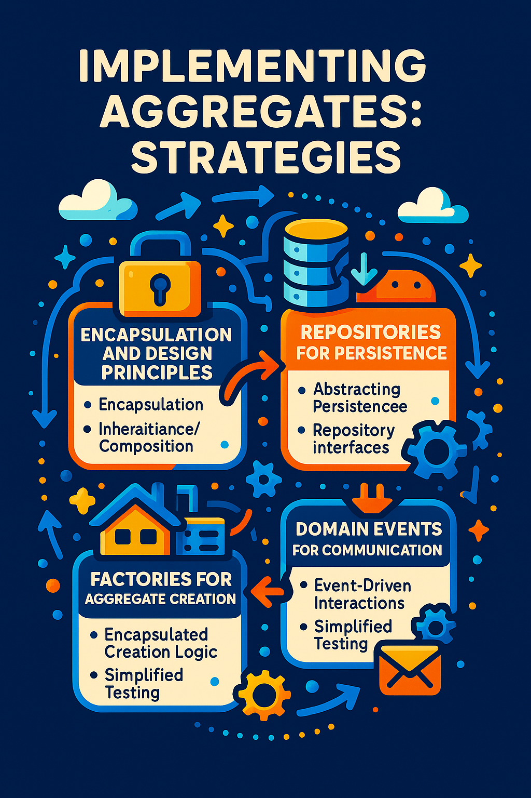

# Aggregates: How to Model Complex Domains with Consistency and Cohesion

## **Table of Contents**

- [Aggregates: How to Model Complex Domains with Consistency and Cohesion](#aggregates-how-to-model-complex-domains-with-consistency-and-cohesion)
  - [**Table of Contents**](#table-of-contents)
  - [**Introduction**](#introduction)
  - [**What Are Aggregates in Domain-Driven Design?**](#what-are-aggregates-in-domain-driven-design)
    - [**Key Characteristics of Aggregates:**](#key-characteristics-of-aggregates)
    - [**Benefits of Aggregates:**](#benefits-of-aggregates)
  - [**Understanding Domain Invariants**](#understanding-domain-invariants)
    - [**What Are Domain Invariants?**](#what-are-domain-invariants)
    - [**Importance of Domain Invariants:**](#importance-of-domain-invariants)
    - [**Expressing Domain Invariants:**](#expressing-domain-invariants)
    - [**Consistency and Performance:**](#consistency-and-performance)
  - [**Discovering Aggregates and Their Boundaries**](#discovering-aggregates-and-their-boundaries)
    - [**1. Leverage Ubiquitous Language and Domain Expertise**](#1-leverage-ubiquitous-language-and-domain-expertise)
    - [**2. Analyze Domain Scenarios and Use Cases**](#2-analyze-domain-scenarios-and-use-cases)
    - [**3. Identify and Enforce Domain Invariants**](#3-identify-and-enforce-domain-invariants)
    - [**4. Simplify with Qualifiers and Constraints**](#4-simplify-with-qualifiers-and-constraints)
    - [**5. Iterative Refinement and Testing**](#5-iterative-refinement-and-testing)
  - [**Designing Aggregates and Their Roots**](#designing-aggregates-and-their-roots)
    - [**Aggregate Root Responsibilities**](#aggregate-root-responsibilities)
    - [**Design Principles for Aggregate Roots**](#design-principles-for-aggregate-roots)
    - [**Relationships with Other Aggregates**](#relationships-with-other-aggregates)
  - [**Implementing Aggregates: Strategies**](#implementing-aggregates-strategies)
    - [**1. Encapsulation and Design Principles**](#1-encapsulation-and-design-principles)
    - [**2. Repositories for Persistence**](#2-repositories-for-persistence)
    - [**3. Factories for Aggregate Creation**](#3-factories-for-aggregate-creation)
    - [**4. Domain Events for Communication**](#4-domain-events-for-communication)
  - [**Testing Aggregates: Strategies and Techniques**](#testing-aggregates-strategies-and-techniques)
    - [**1. Unit Testing**](#1-unit-testing)
    - [**2. Integration Testing**](#2-integration-testing)
    - [**3. Scenario Testing**](#3-scenario-testing)
  - [**Best Practices and Recommendations**](#best-practices-and-recommendations)
    - [**1. Clearly Define Aggregate Boundaries**](#1-clearly-define-aggregate-boundaries)
    - [**2. Prioritize Core Subdomains**](#2-prioritize-core-subdomains)
    - [**3. Utilize Third-Party Solutions for Generic Subdomains**](#3-utilize-third-party-solutions-for-generic-subdomains)
    - [**4. Implement Rigorous Supplier Selection Processes**](#4-implement-rigorous-supplier-selection-processes)
    - [**5. Foster Collaboration Between Internal Teams and Suppliers**](#5-foster-collaboration-between-internal-teams-and-suppliers)
    - [**6. Continuously Monitor and Evaluate Supplier Performance**](#6-continuously-monitor-and-evaluate-supplier-performance)
    - [**7. Ensure Robust Documentation and Knowledge Management**](#7-ensure-robust-documentation-and-knowledge-management)
    - [**8. Embrace Iterative Refinement**](#8-embrace-iterative-refinement)
  - [**Example of an aggregate in SAP**](#example-of-an-aggregate-in-sap)
    - [**Purchase Order Aggregate**](#purchase-order-aggregate)
    - [**Related Entities of Purchase Order in SAP S/4HANA Procurement**](#related-entities-of-purchase-order-in-sap-s4hana-procurement)
    - [**Invariants for Purchase Order**](#invariants-for-purchase-order)
  - [**Conclusion**](#conclusion)
  - [**Further References and Resources**](#further-references-and-resources)
    - [**Books:**](#books)
    - [**Blogs:**](#blogs)
    - [**YouTube:**](#youtube)

## **Introduction**

Domain-Driven Design (DDD) emphasizes the conceptual modeling of the problem domain over mere implementation and technical specifics. By capturing business logic and domain rules in expressive, consistent, and coherent domain models, DDD facilitates the development of software that aligns closely with business needs.

One of the essential tactical patterns in DDD is the **aggregate**. An aggregate is a collection of domain objects treated as a single unit, ensuring consistency and cohesion within complex domains. This article explores what aggregates are, how to discover them, and best practices for designing and implementing them.

## **What Are Aggregates in Domain-Driven Design?**

An **aggregate** is a pattern in DDD that defines a group of related domain objects that are treated as a single unit for data changes. Aggregates ensure that these objects maintain consistency and adhere to business rules within their boundaries.

### **Key Characteristics of Aggregates:**

- **Root Entity:** Each aggregate has a root entity that serves as the main entry point. The root entity is responsible for enforcing business rules and maintaining the consistency of the aggregate.
- **Entities and Value Objects:** Within an aggregate, there can be multiple entities (objects with a unique identity) and value objects (immutable objects defined by their attributes).
- **Boundary:** The aggregate boundary defines what is inside and outside of the aggregate, determining the scope of consistency and transactions.
- **Identity:** The identity of an aggregate is typically derived from the root entity, allowing it to be referenced and manipulated by other aggregates or services.

### **Benefits of Aggregates:**

- **Reduced Complexity:** Simplifies the domain model by encapsulating related objects.
- **Enhanced Performance:** Minimizes the amount of data that needs to be loaded or stored.
- **Improved Consistency:** Ensures that changes within an aggregate are atomic and isolated, maintaining data integrity.
- **Clear Boundaries:** Defines what is relevant for specific use cases, clarifying system limits.

## **Understanding Domain Invariants**

### **What Are Domain Invariants?**

**Domain invariants** are the business rules and constraints that must always hold true within the domain. They reflect the domain's fundamental logic and assumptions, ensuring the accuracy and integrity of the domain model and its data.

### **Importance of Domain Invariants:**

- **Defining Boundaries and Behaviors:** They help in delineating the responsibilities of domain objects and aggregates.
- **Preventing Inconsistent States:** By enforcing invariants, the system avoids entering faulty or inconsistent states.
- **Guiding Aggregate Design:** Aggregates are designed to protect invariants, ensuring that any action violating an invariant is blocked or rejected.

### **Expressing Domain Invariants:**

Domain invariants can be expressed through:

- **Preconditions and Postconditions:** Conditions that must be true before and after an operation.
- **Assertions and Validations:** Checks within the code to enforce rules.
- **Exceptions:** Errors thrown when invariants are violated.

### **Consistency and Performance:**

Depending on the required consistency and performance, invariants can vary in their scope:

- **Single Entity:** Invariants that apply to individual entities or value objects.
- **Entire Aggregate:** Invariants that span multiple entities within an aggregate.
- **Multiple Aggregates:** Invariants that cross aggregate boundaries, often requiring eventual consistency or domain events to manage.

Identifying which invariants must always be upheld (strong consistency) and which can tolerate temporary inconsistencies is crucial for effective aggregate design.

## **Discovering Aggregates and Their Boundaries**

Identifying aggregates and their boundaries is one of the most challenging and critical tasks in DDD. Aggregates are significant clusters of domain objects that change collectively and provide a consistency boundary. Here are techniques and heuristics to discover aggregates and their boundaries:

### **1. Leverage Ubiquitous Language and Domain Expertise**

- **Collaborative Identification:** Work closely with domain experts to identify key concepts and relationships within the domain.
- **Nouns and Verbs:** Use the ubiquitous language to pinpoint entities, value objects, and behaviors that naturally group together.

### **2. Analyze Domain Scenarios and Use Cases**

- **Behavior Mapping:** Examine how domain objects interact to complete tasks or solve problems.
- **Causal Relationships:** Identify cause-and-effect relationships that indicate which objects need to change together.

### **3. Identify and Enforce Domain Invariants**

- **Invariant Clusters:** Group domain objects that share common invariants, ensuring they are encapsulated within the same aggregate.
- **Consistency Boundaries:** Ensure that all changes within an aggregate maintain its invariants.

### **4. Simplify with Qualifiers and Constraints**

- **Filter Associations:** Use qualifiers (e.g., "active") to limit associations and reduce aggregate complexity.
- **Remove Superfluous Links:** Eliminate unnecessary dependencies between domain objects to maintain clarity and simplicity.

### **5. Iterative Refinement and Testing**

- **Prototype Designs:** Create and test different aggregate structures to evaluate their effectiveness.
- **Evaluate Based on Criteria:** Assess designs for expressiveness, consistency, performance, and scalability.

## **Designing Aggregates and Their Roots**

### **Aggregate Root Responsibilities**

Each aggregate has a **single, designated root entity** known as the **aggregate root**. The aggregate root is responsible for:

- **Encapsulating State and Behavior:** Managing the internal state and enforcing business rules within the aggregate.
- **Ensuring Consistency:** Preventing modifications to the aggregate's state except through its public API.
- **Managing References:** Only allowing external objects to reference the aggregate through the aggregate root's identity.

### **Design Principles for Aggregate Roots**

- **Ubiquitous Language:** The root's interface and methods should reflect the domain's language and concepts.
- **Least Astonishment:** The aggregate root's behavior should align with developers' and domain experts' expectations.
- **Command-Query Separation:** Clearly separate commands (actions that change state) from queries (actions that retrieve state).

### **Relationships with Other Aggregates**

- **References via Identifiers:** Instead of direct object references, use identifiers to reference other aggregates. This maintains loose coupling and enhances scalability.
- **Encapsulation:** Avoid exposing internal structures of aggregates to other parts of the system.

## **Implementing Aggregates: Strategies**

Implementing aggregates effectively requires adherence to design principles and leveraging appropriate tools and patterns. Here are common strategies and tips for implementing aggregates:

### **1. Encapsulation and Design Principles**

- **Encapsulation:** Ensure that only the aggregate root can access and modify the internal state of the aggregate.
- **Inheritance/Composition:** Use these principles to reuse behavior and maintain clean code architecture.
- **Polymorphism and Abstraction:** Facilitate flexible and maintainable code by handling different scenarios based on aggregate types.

### **2. Repositories for Persistence**

- **Abstracting Persistence:** Use repositories to manage the loading and saving of aggregates, decoupling domain logic from data access.
- **Repository Interfaces:** Define clear interfaces for repositories, providing methods to load and save aggregates.
- **Single Instance Guarantee:** Ensure that only one instance of an aggregate exists in memory at any given time to prevent inconsistencies.

### **3. Factories for Aggregate Creation**

- **Encapsulated Creation Logic:** Use factories to create aggregates with valid initial states, ensuring all invariants are satisfied from the outset.
- **Simplified Testing:** Factories facilitate the creation of mock or stub aggregates for testing purposes.

### **4. Domain Events for Communication**

- **Event-Driven Interactions:** Use domain events to communicate changes within aggregates to other parts of the system, promoting loose coupling.
- **Decoupling Aggregates:** Avoid direct dependencies between aggregates by leveraging domain events for inter-aggregate communication.

## **Testing Aggregates: Strategies and Techniques**

Testing aggregates is essential to ensure that they function correctly and adhere to business requirements. Here are various testing strategies and techniques for aggregates:

### **1. Unit Testing**

**Purpose:** Verify the behavior and state of individual aggregates in isolation.

**Approach:**

- **Isolated Tests:** Focus on a single aggregate without dependencies on external systems.
- **Mocking Dependencies:** Use mock or stub repositories and other aggregates to simulate interactions.
- **Behavior Verification:** Ensure that methods enforce domain invariants and perform expected state transitions.

### **2. Integration Testing**

**Purpose:** Validate the interaction and integration of aggregates with other system components.

**Approach:**

- **Realistic Interactions:** Test how aggregates interact with real or simulated databases, services, or events.
- **End-to-End Scenarios:** Ensure that changes within aggregates propagate correctly across the system.
- **Data Consistency:** Verify that data remains consistent when multiple aggregates are involved.

### **3. Scenario Testing**

**Purpose:** Validate the end-to-end functionality and behavior of aggregates within real-world scenarios.

**Approach:**

- **User Stories:** Simulate user actions and business processes that involve multiple aggregates or services.
- **Complex Interactions:** Test scenarios that involve a series of operations and state changes across aggregates.
- **Outcome Verification:** Ensure that the system behaves as expected under various conditions.

## **Best Practices and Recommendations**

To effectively design, implement, and manage aggregates within DDD, consider the following best practices:

### **1. Clearly Define Aggregate Boundaries**

- **Strategic Design:** Use strategic design techniques to delineate core, supporting, and generic subdomains.
- **Domain Alignment:** Ensure that boundaries align with business processes and objectives.

### **2. Prioritize Core Subdomains**

- **Resource Allocation:** Allocate top-tier developers to core subdomains to maximize business value.
- **Continuous Learning:** Invest in ongoing training and development to keep expertise sharp.

### **3. Utilize Third-Party Solutions for Generic Subdomains**

- **Cost-Effectiveness:** Assess the viability of third-party solutions versus in-house development.
- **Supplier Reliability:** Choose suppliers with strong reputations and proven track records.

### **4. Implement Rigorous Supplier Selection Processes**

- **Evaluation Framework:** Develop a standardized framework for assessing potential suppliers based on key criteria.
- **Thorough Due Diligence:** Conduct comprehensive assessments to ensure alignment with business needs and compliance requirements.

### **5. Foster Collaboration Between Internal Teams and Suppliers**

- **Open Communication:** Maintain transparent and consistent communication channels to ensure smooth integration and issue resolution.
- **Knowledge Sharing:** Encourage knowledge transfer and collaboration to enhance mutual understanding and effectiveness.

### **6. Continuously Monitor and Evaluate Supplier Performance**

- **Metrics and KPIs:** Establish clear metrics and KPIs to regularly assess supplier performance.
- **Performance Reviews:** Conduct periodic reviews to ensure suppliers meet quality and reliability standards.

### **7. Ensure Robust Documentation and Knowledge Management**

- **Aggregate Documentation:** Document domain and aggregate structures, including interactions and dependencies.
- **Supplier Agreements:** Maintain comprehensive records of supplier agreements, evaluations, and performance metrics.

### **8. Embrace Iterative Refinement**

- **Design Iteration:** Continuously refine aggregate designs based on feedback, changing business requirements, and performance metrics.
- **Agile Adaptation:** Adopt agile methodologies to allow for flexible and responsive design adjustments.

## **Example of an aggregate in SAP**

Below is a list of business objects from SAP S/4HANA and SAP Ariba that can be considered Aggregates, along with their corresponding Bounded Contexts:

| **Solution** | **Component** | **Aggregate (Business Object)** | **Bounded Context**  |
| ------------ | ------------- | ------------------------------- | -------------------- |
| SAP S/4HANA  | Procurement   | Purchase Order                  | Procurement          |
| SAP S/4HANA  | Procurement   | Purchase Requisition            | Procurement          |
| SAP S/4HANA  | Procurement   | Supplier Invoice                | Procurement          |
| SAP S/4HANA  | Procurement   | Goods Receipt                   | Inventory Management |
| SAP S/4HANA  | Procurement   | Contract                        | Procurement          |
| SAP S/4HANA  | Procurement   | Scheduling Agreement            | Procurement          |
| SAP S/4HANA  | Procurement   | Source List                     | Procurement          |
| SAP S/4HANA  | Procurement   | Quotation                       | Procurement          |
| SAP S/4HANA  | Procurement   | Info Record                     | Procurement          |
| SAP S/4HANA  | Procurement   | Supplier Data                   | Supplier Management  |
| SAP Ariba    | Procurement   | Requisition                     | Procurement          |
| SAP Ariba    | Procurement   | Purchase Order                  | Procurement          |
| SAP Ariba    | Procurement   | Invoice                         | Procurement          |
| SAP Ariba    | Procurement   | Contract Workspace              | Procurement          |
| SAP Ariba    | Procurement   | Supplier Performance Management | Supplier Management  |
| SAP Ariba    | Procurement   | Sourcing Project                | Sourcing             |
| SAP Ariba    | Procurement   | Supplier Risk Assessment        | Supplier Risk        |

### **Purchase Order Aggregate**

In SAP S/4HANA Procurement, the **Purchase Order** business object serves as an Aggregate and involves multiple related entities that work together to represent a complete and consistent unit. Here are the related entities typically associated with a **Purchase Order**:

### **Related Entities of Purchase Order in SAP S/4HANA Procurement**

1. **Purchase Order Item**: Represents individual line items within the purchase order, detailing the specific materials or services being procured.
2. **Supplier (Vendor)**: The entity from which goods or services are purchased. Contains key information such as supplier ID, name, and address.
3. **Material**: Represents the specific materials being ordered and includes details such as material number, description, and stock status.
4. **Pricing Conditions**: Entities that define the pricing details for each item, including discounts, taxes, and additional charges.
5. **Delivery Schedule**: Specifies delivery dates and quantities for each item, ensuring the timely receipt of goods or services.
6. **Account Assignment**: Links purchase order items to cost centers, projects, or other accounting objects, ensuring proper financial allocation.
7. **Document Flow**: Tracks the relationships between different procurement documents, such as requisitions, contracts, and goods receipts.
8. **Approval Workflow**: Contains details related to the approval process required for authorizing the purchase order.
9. **Purchase Order History**: Provides a record of all changes and transactions associated with the purchase order, such as goods receipts and invoice postings.
10. **Terms of Delivery and Payment**: Defines the agreed-upon terms for delivery and payment between the buyer and the supplier.
11. **Currency and Exchange Rate**: Information on the currency used in the purchase order and any exchange rate considerations.

### **Invariants for Purchase Order**

- **Atomic Consistency**: All line items in a purchase order must be consistent, meaning that changes to the purchase order as a whole must ensure that no item is left in an incomplete or invalid state.
- **Referential Integrity**: Each purchase order must be linked to an existing and valid supplier, ensuring that orders are placed only with approved vendors.
- **Approval Validity**: The purchase order must receive proper authorization before being confirmed, ensuring compliance with procurement policies.
- **Financial Allocation**: The account assignment must align with the financial structure, ensuring that budget limits and accounting rules are not violated.
- **Document Completion**: The purchase order must be fully populated with all necessary fields, such as item details, delivery dates, and payment terms, before it can be processed.
- **Status Consistency**: The status of the purchase order (e.g., created, approved, partially received, completed) must reflect its true state within the procurement lifecycle.

These related entities and consistency rules ensure that a **Purchase Order** in SAP S/4HANA functions as a cohesive and valid Aggregate within the **Procurement** Bounded Context.

## **Conclusion**

Aggregates are pivotal in Domain-Driven Design, serving as clusters of domain objects that are treated as single units to ensure consistency and enforce business rules. By thoughtfully designing aggregates and their roots, leveraging repositories and factories, and utilizing domain events for communication, developers can create robust, maintainable, and scalable domain models.

From a management perspective, strategically allocating top developers to core subdomains while leveraging third-party support for generic areas optimizes resource utilization and enhances project efficiency. Critical to this strategy is meticulous supplier selection and due diligence, ensuring that generic subdomains are supported by reliable, secure, and compatible solutions.

Adhering to best practices in aggregate design, implementation, and testing fosters a harmonious balance between in-house expertise and external support, driving innovation and maintaining competitive advantage. This integrated approach not only aligns software architecture with business objectives but also ensures that development, governance, delivery, and operations work cohesively to deliver high-quality, compliant, and scalable software solutions.

By thoroughly understanding and applying the principles of aggregates in Domain-Driven Design, developers and managers can build systems that are not only technically robust but also closely aligned with business goals and requirements. This alignment ensures that the software not only meets current needs but is also adaptable to future changes and scaling demands.

## **Further References and Resources**

### **Books:**

- _Domain-Driven Design: Tackling Complexity in the Heart of Software_ by Eric Evans
- _Implementing Domain-Driven Design_ by Vaughn Vernon
- _Domain-Driven Design Reference_ by Eric Evans
- _Domain-Driven Design Distilled_ by Vaughn Vernon

### **Blogs:**

- [Domain-Driven Design: Aggregates](https://www.jamesmichaelhickey.com/domain-driven-design-aggregates/)
- [Understanding Aggregates in Domain-Driven Design](https://dzone.com/articles/domain-driven-design-aggregate)
- [DDD Aggregate - Martin Fowler](https://www.martinfowler.com/bliki/DDD_Aggregate.html)

### **YouTube:**

- [Vaughn Vernon - How to Use Aggregates for Tactical Design](https://www.youtube.com/watch?v=Xf_aLAK1RfE)
- [Vaughn Vernon - Effective Aggregate Design Part II](https://www.youtube.com/watch?v=JOsv01y8dlw)
- [Thomas Ploch: What is a DDD Aggregate? - DDD Europe 2022](https://www.youtube.com/watch?v=zlFqjD2LKlE)
- [Codewrinkles: Aggregate Modeling With THESE 3 Steps](https://www.youtube.com/watch?v=E2ctgrKhqBw)
- [Amichai Mantinband: Aggregates, Entities & Value Objects](https://www.youtube.com/watch?v=UEtmOW8uZZY)
- [Milan Jovanović: Aggregate Root Design 101 | DDD, Clean Architecture, .NET 6](https://www.youtube.com/watch?v=0D3EB2jvQ44)
